# Workout Module API Documentation

> **Purpose:** Powers the entire workout management system — exercise library (with media uploads), workout plans (templates with clone support), bulk exercise management, workout assignments to members (with recurring schedules and plan versioning/snapshots), session/schedule tracking (with pause/resume and in-session exercise substitution), set/rep logging, trainer feedback (with visibility controls), body measurements (with progress photos), member goals (with computed progress percentage), calendar view, personal records, activity heatmaps, and automated notifications (workout reminders, missed workout nudges). Used by trainers to design and assign workouts, by members to log their sessions and track progress, and by the app to display workout schedules, analytics, and historical data.

Base path:

```txt
/api/workout
```

All routes require authentication via JWT bearer token.

Header:

```txt
Authorization: Bearer <access_token>
Content-Type: application/json
```

Common enum values:

```txt
WorkoutGoal:       WEIGHT_LOSS, MUSCLE_GAIN, STRENGTH, ENDURANCE, FAT_BURN
DifficultyLevel:   BEGINNER, INTERMEDIATE, ADVANCED
MuscleGroup:       CHEST, BACK, LEGS, SHOULDERS, ARMS, CORE, FULL_BODY
ExerciseType:      STRENGTH, BODYWEIGHT, CARDIO
WorkoutTrainerRole: PRIMARY, ASSISTANT, SUBSTITUTE
RepeatType:         NONE, DAILY, WEEKLY, CUSTOM
UnassignReason:     MEMBER_REQUEST, TRAINER_DECISION, INJURY, GOAL_COMPLETE, OTHER
FeedbackVisibility:  PRIVATE, MEMBER_VISIBLE, TEAM_VISIBLE
MediaType:          IMAGE, VIDEO, GIF
SessionStatus:      IN_PROGRESS, COMPLETED, CANCELLED
SetType:            WARMUP, WORKING, DROP_SET, FAILURE, REST_PAUSE, CARDIO
ScheduleStatus:     SCHEDULED, CHECKED_IN, COMPLETED, MISSED, CANCELLED
MemberGoalType:     WEIGHT_LOSS, MUSCLE_GAIN, STRENGTH, ENDURANCE, CONSISTENCY, CUSTOM
MemberGoalStatus:   ACTIVE, ACHIEVED, CANCELLED
```

---

## API Flow

The workout module follows a 4-phase lifecycle. Each phase is performed by a specific role.

```mermaid
flowchart TB
  classDef admin fill:#e1f5fe,stroke:#01579b,stroke-width:2px
  classDef trainer fill:#fff3e0,stroke:#e65100,stroke-width:2px
  classDef member fill:#e8f5e9,stroke:#1b5e20,stroke-width:2px
  classDef entity fill:#f3e5f5,stroke:#4a148c,stroke-width:1px

  subgraph PHASE1["Phase 1 — Build (Admin / Trainer)"]
    direction TB
    A1[POST /exercises] --> A2[POST /workouts]
    A2 --> A3[POST /workouts/:id/days]
    A3 --> A4[POST /days/:id/exercises]
    A4 --> A5[POST /workouts/:id/trainers]
    A5 --> A6[POST /exercises/bulk]
    A6 --> A7[POST /exercises/:exerciseId/media]
    A7 --> A8[POST /workouts/:id/clone]
  end

  subgraph PHASE2["Phase 2 — Assign (Admin / Trainer)"]
    direction TB
    B1[POST /workouts/:id/assign] --> B2[DELETE /assignments/:id]
  end

  subgraph PHASE3["Phase 3 — Execute (Member)"]
    direction TB
    C1[GET /my/workouts] --> C2[GET /workouts/:id]
    C2 --> C3[GET /my/calendar]
    C3 --> C4[POST /sessions/:id/pause]
    C4 --> C5[POST /sessions/:id/resume]
  end

  subgraph PHASE4["Phase 4 — Manage (Admin / Trainer)"]
    direction TB
    D1[GET /users/:id/workouts] --> D2[GET /exercises]
    D2 --> D3[PATCH /workout-exercises/:id]
    D3 --> D4[GET /my/analytics/prs]
    D4 --> D5[GET /my/analytics/heatmap]
    D5 --> D6[GET /my/analytics/strength-score]
  end

  PHASE1 --> PHASE2
  PHASE2 --> PHASE3
  PHASE3 --> PHASE4

  class A1,A2,A3,A4,A5,A6,A7,A8 admin
  class B1,B2 trainer
  class C1,C2,C3,C4,C5 member
  class D1,D2,D3,D4,D5,D6 trainer
```



**Permission mapping by role:**

| Role | Workout Permissions |
|------|-------------------|
| **Admin / Owner** | `workout.read`, `workout.write`, `workout.assign`, `workout.progress` |
| **Trainer** | `workout.read`, `workout.write`, `workout.assign`, `workout.progress` |
| **Receptionist** | `workout.read`, `workout.progress` |
| **Member** | `workout.read`, `workout.progress` |

---

## Workout Plans

### Create Workout Plan

```http
POST /api/workout/workouts
```

Body:

```json
{
  "name": "Beginner Full Body",
  "description": "A balanced full-body program for beginners",
  "image": "https://example.com/workout.png",
  "goal": "STRENGTH",
  "difficulty": "BEGINNER",
  "duration": 30
}
```

Notes:
- `name`, `goal`, `difficulty` are required.
- `duration` must be greater than `0`.
- `image` is optional — a URL to a workout plan image.

### Get All Workout Plans

```http
GET /api/workout/workouts
```

### Get Workout Plan by ID

```http
GET /api/workout/workouts/:id
```

Returns a single workout plan with all nested days and exercises.

### Update Workout Plan

```http
PATCH /api/workout/workouts/:id
```

Body (partial update):

```json
{
  "name": "Intermediate Full Body",
  "difficulty": "INTERMEDIATE",
  "image": "https://example.com/updated-workout.png"
}
```

### Delete Workout Plan

```http
DELETE /api/workout/workouts/:id
```

Permanently deletes a workout plan and all its days and exercises.

### Clone Workout Plan

```http
POST /api/workout/workouts/:id/clone
```

Body:

```json
{
  "name": "Beginner Full Body (Copy)"
}
```

Creates a deep copy of the plan including all days, exercises, and supersets.

---

## Workout Days

### Create Workout Day

```http
POST /api/workout/workouts/:id/days
```

Body:

```json
{
  "dayNumber": 1,
  "title": "Day 1 - Upper Body",
  "notes": "Focus on controlled negatives"
}
```

Notes:
- `dayNumber` and `title` are required.
- `dayNumber` must be unique per workout plan.
- Auto-schedules for active assignments.

### Get Workout Days

```http
GET /api/workout/workouts/:id/days
```

### Update Workout Day

```http
PATCH /api/workout/days/:id
```

### Delete Workout Day

```http
DELETE /api/workout/days/:id
```

---

## Exercises (Exercise Library)

### Create Exercise

```http
POST /api/workout/exercises
```

Body:

```json
{
  "name": "Barbell Bench Press",
  "muscleGroup": "CHEST",
  "exerciseType": "STRENGTH",
  "instructions": "Lie on a flat bench...",
  "videoUrl": "https://example.com/bench-press.mp4",
  "calories": 50
}
```

Notes:
- `name` and `muscleGroup` are required.
- `exerciseType` is optional (defaults to `STRENGTH`). Accepted values:
  - `STRENGTH` — exercises with external load. Estimated 1RM calculated from logged weight.
  - `BODYWEIGHT` — bodyweight exercises. 1RM calculated from total load (body weight + added weight).
  - `CARDIO` — cardio exercises. No 1RM calculation.

### Get All Exercises

```http
GET /api/workout/exercises?muscleGroup=CHEST&search=bench
```

Optional query parameters: `muscleGroup`, `search`.

### Get Exercise by ID

```http
GET /api/workout/exercises/:id
```

### Update Exercise

```http
PATCH /api/workout/exercises/:id
```

Body (partial update):

```json
{
  "name": "Dumbbell Bench Press",
  "muscleGroup": "CHEST",
  "exerciseType": "STRENGTH"
}
```

### Delete Exercise

```http
DELETE /api/workout/exercises/:id
```

Soft-deletes an exercise from the library.

### Bulk Create Exercises

```http
POST /api/workout/exercises/bulk
```

Body:

```json
{
  "exercises": [
    { "name": "Bench Press", "muscleGroup": "CHEST" },
    { "name": "Squat", "muscleGroup": "LEGS" }
  ]
}
```

Maximum 100 exercises per call.

### Bulk Delete Exercises

```http
DELETE /api/workout/exercises/bulk
```

Body:

```json
{
  "ids": ["uuid1", "uuid2"]
}
```

---

## Workout Exercises (Linking Exercises to Days)

### Create Workout Exercise

```http
POST /api/workout/days/:id/exercises
```

Body:

```json
{
  "exerciseId": "uuid",
  "sets": 3,
  "reps": 10,
  "duration": null,
  "restTime": 60,
  "supersetGroupId": "uuid (optional)",
  "orderIndex": 1
}
```

### Update Workout Exercise

```http
PATCH /api/workout/workout-exercises/:id
```

### Delete Workout Exercise

```http
DELETE /api/workout/workout-exercises/:id
```

---

## Workout Trainers

### Assign Trainer to Workout Plan

```http
POST /api/workout/workouts/:id/trainers
```

Body:

```json
{
  "trainerId": "uuid",
  "role": "PRIMARY"
}
```

### Get Workout Trainers

```http
GET /api/workout/workouts/:id/trainers
```

### Remove Trainer from Workout Plan

```http
DELETE /api/workout/workouts/:id/trainers/:trainerId
```

---

## Workout Assignments

### Assign Workout Plan to a User

```http
POST /api/workout/workouts/:id/assign
```

Body:

```json
{
  "userId": "uuid",
  "startDate": "2026-06-16T00:00:00.000Z",
  "endDate": "2026-07-16T00:00:00.000Z",
  "repeatType": "NONE",
  "repeatDays": [1, 3, 5],
  "repeatEndDate": "2026-09-01T00:00:00.000Z"
}
```

Notes:
- `repeatType` defaults to `NONE`. Use `WEEKLY` or `CUSTOM` for recurring schedules.
- `repeatDays` is required when `repeatType` is `WEEKLY` or `CUSTOM` (1=Mon..7=Sun).
- A workout can only be assigned once per user (duplicate returns 400).
- Schedules are auto-created from workout days.

### Update Assignment

```http
PATCH /api/workout/assignments/:id
```

Body (partial update):

```json
{
  "startDate": "2026-07-01T00:00:00.000Z",
  "endDate": "2026-08-01T00:00:00.000Z"
}
```

### Reassign Workout Plan

```http
POST /api/workout/assignments/:id/reassign
```

Body:

```json
{
  "workoutPlanId": "uuid",
  "startDate": "2026-07-01T00:00:00.000Z",
  "endDate": "2026-08-01T00:00:00.000Z"
}
```

### Unassign Workout Plan

```http
DELETE /api/workout/assignments/:id
```

Body (optional):

```json
{
  "reason": "MEMBER_REQUEST"
}
```

### Get My Workouts (Current User)

```http
GET /api/workout/my/workouts
```

### Get User Workouts (Staff/Trainer)

```http
GET /api/workout/users/:id/workouts
```

---

## Workout Sessions

### Start Session

```http
POST /api/workout/sessions/start
```

Body:

```json
{
  "workoutDayId": "uuid (optional)",
  "workoutPlanId": "uuid (optional)",
  "assignmentId": "uuid (optional)",
  "notes": "Feeling energized today"
}
```

Only one active session at a time. Returns 400 if another is in progress.

### Get Active Session

```http
GET /api/workout/sessions/active
```

Returns the current active session with day exercises, supersets, and logged sets.

### End Session

```http
PATCH /api/workout/sessions/:id/end
```

Body:

```json
{
  "energyLevel": 8,
  "mood": 9,
  "notes": "Great session"
}
```

`energyLevel` and `mood` are 1-10.

### Update Session

```http
PATCH /api/workout/sessions/:id
```

### Get Session by ID

```http
GET /api/workout/sessions/:id
```

### Get My Sessions

```http
GET /api/workout/my/sessions?page=1&limit=20&status=COMPLETED&from=2026-06-01&to=2026-06-17
```

### Get User Sessions (Staff View)

```http
GET /api/workout/users/:id/sessions
```

### Pause Session

```http
POST /api/workout/sessions/:id/pause
```

### Resume Session

```http
POST /api/workout/sessions/:id/resume
```

### Session Exercise Swap

```http
POST /api/workout/sessions/:id/exercises/:exerciseId/substitute
```

Body:

```json
{
  "substituteExerciseId": "uuid",
  "reason": "Equipment unavailable"
}
```

### Get Session Swaps

```http
GET /api/workout/sessions/:id/swaps
```

---

## Exercise Set Logs

### Log a Single Set

```http
POST /api/workout/sessions/:sessionId/sets
```

Body:

```json
{
  "workoutExerciseId": "uuid",
  "exerciseId": "uuid",
  "setNumber": 1,
  "setType": "WORKING",
  "weight": 80.5,
  "actualReps": 10,
  "duration": null,
  "distance": null,
  "rpe": 8,
  "restTime": 90,
  "completed": true,
  "notes": "Felt controlled"
}
```

### Bulk Log Sets

```http
POST /api/workout/sessions/:sessionId/bulk-sets
```

Body:

```json
{
  "sets": [
    {
      "workoutExerciseId": "uuid",
      "exerciseId": "uuid",
      "setNumber": 1,
      "setType": "WARMUP",
      "weight": 40,
      "actualReps": 10,
      "rpe": 4
    }
  ]
}
```

Maximum 50 sets per call.

### Update Set Log

```http
PATCH /api/workout/sessions/sets/:id
```

### Delete Set Log

```http
DELETE /api/workout/sessions/sets/:id
```

---

## Workout Scheduling

### Create Scheduled Workout

```http
POST /api/workout/schedules
```

Body:

```json
{
  "workoutDayId": "uuid",
  "assignmentId": "uuid (optional)",
  "scheduledDate": "2026-06-18T00:00:00.000Z",
  "scheduledTime": "10:00",
  "notes": "Focus on form"
}
```

### Get My Schedules

```http
GET /api/workout/my/schedules?page=1&limit=20&from=2026-06-01&to=2026-06-30&status=SCHEDULED
```

### Get Upcoming Schedules

```http
GET /api/workout/my/schedules/upcoming
```

Returns the next 10 upcoming scheduled workouts.

### Update Schedule

```http
PATCH /api/workout/schedules/:id
```

### Delete Schedule

```http
DELETE /api/workout/schedules/:id
```

### Check In to Scheduled Workout

```http
POST /api/workout/schedules/:id/check-in
```

### Calendar View

```http
GET /api/workout/my/calendar?year=2026&month=6
```

---

## Body Measurements

### Create Measurement

```http
POST /api/workout/measurements
```

Body:

```json
{
  "date": "2026-06-17T00:00:00.000Z",
  "weight": 82.5,
  "bodyFat": 15.2,
  "chest": 110,
  "waist": 85,
  "hips": 98,
  "arms": 38,
  "thighs": 55,
  "calves": 36,
  "shoulders": 120,
  "notes": "Morning measurement",
  "photoFront": "https://example.com/front.jpg",
  "photoSide": "https://example.com/side.jpg",
  "photoBack": "https://example.com/back.jpg"
}
```

### Get My Measurements

```http
GET /api/workout/my/measurements?page=1&limit=20&from=2026-01-01&to=2026-06-17
```

### Get Latest Measurement

```http
GET /api/workout/my/measurements/latest
```

### Get Measurement Trends

```http
GET /api/workout/my/measurements/trends
```

### Update Measurement

```http
PATCH /api/workout/measurements/:id
```

### Delete Measurement

```http
DELETE /api/workout/measurements/:id
```

---

## Workout Goals

### Create Goal

```http
POST /api/workout/goals
```

Body:

```json
{
  "type": "STRENGTH",
  "title": "Bench Press 100kg",
  "description": "Reach 100kg bench press for 5 reps",
  "targetValue": 100,
  "unit": "kg",
  "startDate": "2026-06-01T00:00:00.000Z",
  "targetDate": "2026-08-01T00:00:00.000Z"
}
```

### Get My Goals

```http
GET /api/workout/my/goals?page=1&limit=20&status=ACTIVE
```

Each goal includes computed `progressPercentage`: `Math.round((currentValue / targetValue) * 100)`.

### Get Goal with Milestones

```http
GET /api/workout/my/goals/:id
```

### Add Milestone

```http
POST /api/workout/goals/:id/milestones
```

Body:

```json
{
  "milestoneDate": "2026-07-01T00:00:00.000Z",
  "value": 85,
  "notes": "5kg away from target!"
}
```

### Achieve Goal

```http
POST /api/workout/goals/:id/achieve
```

### Update Goal

```http
PATCH /api/workout/goals/:id
```

### Delete Goal

```http
DELETE /api/workout/goals/:id
```

---

## Superset Groups

### Create Superset Group

```http
POST /api/workout/days/:dayId/supersets
```

Body:

```json
{
  "name": "Superset 1",
  "restAfterRound": 120,
  "orderIndex": 1
}
```

### Get Superset Groups for a Day

```http
GET /api/workout/days/:dayId/supersets
```

### Update Superset Group

```http
PATCH /api/workout/days/supersets/:id
```

### Delete Superset Group

```http
DELETE /api/workout/days/supersets/:id
```

---

## Exercise Substitutions

### Create Substitution

```http
POST /api/workout/exercises/:exerciseId/substitutions
```

Body:

```json
{
  "substituteExerciseId": "uuid",
  "reason": "Equipment unavailable - use dumbbells instead of barbell"
}
```

### Get Substitutions

```http
GET /api/workout/exercises/:exerciseId/substitutions
```

### Delete Substitution

```http
DELETE /api/workout/exercises/substitutions/:id
```

---

## Exercise Media

### Upload Exercise Media

```http
POST /api/workout/exercises/:exerciseId/media
```

Body:

```json
{
  "type": "IMAGE",
  "url": "https://example.com/bench-press-form.jpg",
  "caption": "Proper bench press form",
  "orderIndex": 1
}
```

### Get Exercise Media

```http
GET /api/workout/exercises/:exerciseId/media
```

### Update Exercise Media

```http
PATCH /api/workout/exercises/media/:id
```

### Delete Exercise Media

```http
DELETE /api/workout/exercises/media/:id
```

---

## Trainer Feedback

### Create Feedback

```http
POST /api/workout/feedback
```

Body:

```json
{
  "memberId": "uuid",
  "workoutSessionId": "uuid (optional)",
  "feedback": "Great form on bench press. Try increasing weight next session.",
  "rating": 4,
  "visibility": "MEMBER_VISIBLE",
  "category": "form"
}
```

- `visibility` defaults to `MEMBER_VISIBLE`. Options: `PRIVATE`, `MEMBER_VISIBLE`, `TEAM_VISIBLE`.

### View My Feedback (Member)

```http
GET /api/workout/my/feedback
```

### View Member's Feedback (Trainer)

```http
GET /api/workout/users/:id/feedback
```

### Mark as Read

```http
PATCH /api/workout/feedback/:id/read
```

---

## Analytics

### Dashboard

```http
GET /api/workout/my/analytics/dashboard
```

Returns:
- `totalSessions` — lifetime completed sessions
- `weeklySessions` — sessions this week
- `weeklyActiveMinutes` — total active workout minutes this week
- `weeklyGymMinutes` — total gym time this week
- `weeklyCaloriesBurned` — total calories burned this week
- `currentStreak` — consecutive days with a session
- `volumeByMuscleGroup` — total volume (weight x reps) per muscle group (last 28 days)
- `recentPRs` — top 10 personal records with estimated 1RM
- `averageCompletionRate` — average reps performed vs prescribed

### Volume Trend

```http
GET /api/workout/my/analytics/volume?muscleGroup=CHEST&days=90
```

### Volume Per Exercise

```http
GET /api/workout/my/analytics/volume-per-exercise?muscleGroup=CHEST&days=90
```

### Consistency

```http
GET /api/workout/my/analytics/consistency
```

### Personal Records

```http
GET /api/workout/my/analytics/prs
```

### Activity Heatmap

```http
GET /api/workout/my/analytics/heatmap
```

### Exercise Progress

```http
GET /api/workout/my/analytics/exercises/:exerciseId/progress?days=365
```

### Duration Trend

```http
GET /api/workout/my/analytics/duration-trend?days=90
```

### Calories Trend

```http
GET /api/workout/my/analytics/calories-trend?days=90
```

### Exercise Distribution

```http
GET /api/workout/my/analytics/exercise-distribution?days=365&limit=10
```

### Workout Frequency

```http
GET /api/workout/my/analytics/workout-frequency?days=365
```

### Adherence Trend

```http
GET /api/workout/my/analytics/adherence-trend?days=90
```

### Goal History

```http
GET /api/workout/my/analytics/goal-history/:goalId
```

### Strength Score

```http
GET /api/workout/my/analytics/strength-score
```

---

## Complete API Reference Table

| # | Method | Path | Permission | Description |
|---|--------|------|-----------|-------------|
| 1 | POST | `/api/workout/exercises` | workout.write | Create exercise |
| 2 | GET | `/api/workout/exercises` | workout.read | List exercises |
| 3 | GET | `/api/workout/exercises/:id` | workout.read | Get exercise |
| 4 | PATCH | `/api/workout/exercises/:id` | workout.write | Update exercise |
| 5 | DELETE | `/api/workout/exercises/:id` | workout.write | Delete exercise |
| 6 | POST | `/api/workout/exercises/:exerciseId/substitutions` | workout.write | Add substitution |
| 7 | GET | `/api/workout/exercises/:exerciseId/substitutions` | workout.read | Get substitutions |
| 8 | DELETE | `/api/workout/exercises/substitutions/:id` | workout.write | Remove substitution |
| 9 | POST | `/api/workout/workouts` | workout.write | Create plan |
| 10 | GET | `/api/workout/workouts` | workout.read | List plans |
| 11 | GET | `/api/workout/workouts/:id` | workout.read | Get plan |
| 12 | PATCH | `/api/workout/workouts/:id` | workout.write | Update plan |
| 13 | DELETE | `/api/workout/workouts/:id` | workout.write | Delete plan |
| 14 | POST | `/api/workout/workouts/:id/days` | workout.write | Add day to plan |
| 15 | GET | `/api/workout/workouts/:id/days` | workout.read | Get days |
| 16 | PATCH | `/api/workout/days/:id` | workout.write | Update day |
| 17 | DELETE | `/api/workout/days/:id` | workout.write | Delete day |
| 18 | POST | `/api/workout/days/:dayId/supersets` | workout.write | Create superset group |
| 19 | GET | `/api/workout/days/:dayId/supersets` | workout.read | Get superset groups |
| 20 | PATCH | `/api/workout/days/supersets/:id` | workout.write | Update superset |
| 21 | DELETE | `/api/workout/days/supersets/:id` | workout.write | Delete superset |
| 22 | POST | `/api/workout/days/:id/exercises` | workout.write | Link exercise to day |
| 23 | PATCH | `/api/workout/workout-exercises/:id` | workout.write | Update exercise link |
| 24 | DELETE | `/api/workout/workout-exercises/:id` | workout.write | Remove exercise link |
| 25 | POST | `/api/workout/workouts/:id/trainers` | workout.assign | Assign trainer to plan |
| 26 | GET | `/api/workout/workouts/:id/trainers` | workout.read | List trainers |
| 27 | DELETE | `/api/workout/workouts/:id/trainers/:trainerId` | workout.assign | Remove trainer |
| 28 | POST | `/api/workout/workouts/:id/assign` | workout.assign | Assign plan to member |
| 29 | PATCH | `/api/workout/assignments/:id` | workout.assign | Update assignment dates |
| 30 | DELETE | `/api/workout/assignments/:id` | workout.assign | Unassign member |
| 31 | POST | `/api/workout/assignments/:id/reassign` | workout.assign | Reassign to a different plan |
| 32 | GET | `/api/workout/my/workouts` | workout.read | My assigned plans |
| 33 | GET | `/api/workout/users/:id/workouts` | workout.read | User's plans (staff) |
| 34 | POST | `/api/workout/sessions/start` | workout.session | Start workout session |
| 35 | GET | `/api/workout/sessions/active` | workout.session | Get active session |
| 36 | GET | `/api/workout/sessions/:id` | workout.session | Get session detail |
| 37 | PATCH | `/api/workout/sessions/:id` | workout.session | Update session |
| 38 | PATCH | `/api/workout/sessions/:id/end` | workout.session | End session |
| 39 | GET | `/api/workout/my/sessions` | workout.session | My sessions history |
| 40 | GET | `/api/workout/users/:id/sessions` | workout.read | User's sessions (staff) |
| 41 | POST | `/api/workout/sessions/:sessionId/sets` | workout.session | Log a set |
| 42 | POST | `/api/workout/sessions/:sessionId/bulk-sets` | workout.session | Bulk log sets |
| 43 | PATCH | `/api/workout/sessions/sets/:id` | workout.session | Update set |
| 44 | DELETE | `/api/workout/sessions/sets/:id` | workout.session | Delete set |
| 45 | POST | `/api/workout/schedules` | workout.schedule | Schedule a workout |
| 46 | GET | `/api/workout/my/schedules` | workout.schedule | My schedules |
| 47 | GET | `/api/workout/my/schedules/upcoming` | workout.schedule | Upcoming schedules |
| 48 | PATCH | `/api/workout/schedules/:id` | workout.schedule | Update schedule |
| 49 | DELETE | `/api/workout/schedules/:id` | workout.schedule | Delete schedule |
| 50 | POST | `/api/workout/schedules/:id/check-in` | workout.session | Check in to schedule |
| 51 | POST | `/api/workout/measurements` | workout.measurements | Log body measurement |
| 52 | GET | `/api/workout/my/measurements` | workout.measurements | My measurements |
| 53 | GET | `/api/workout/my/measurements/latest` | workout.measurements | Latest measurement |
| 54 | PATCH | `/api/workout/measurements/:id` | workout.measurements | Update measurement |
| 55 | DELETE | `/api/workout/measurements/:id` | workout.measurements | Delete measurement |
| 56 | GET | `/api/workout/my/measurements/trends` | workout.measurements | Measurement trends |
| 57 | POST | `/api/workout/goals` | workout.goals | Create goal |
| 58 | GET | `/api/workout/my/goals` | workout.goals | My goals |
| 59 | GET | `/api/workout/my/goals/:id` | workout.goals | Get goal with milestones |
| 60 | PATCH | `/api/workout/goals/:id` | workout.goals | Update goal |
| 61 | DELETE | `/api/workout/goals/:id` | workout.goals | Delete goal |
| 62 | POST | `/api/workout/goals/:id/milestones` | workout.goals | Add milestone |
| 63 | POST | `/api/workout/goals/:id/achieve` | workout.goals | Achieve goal |
| 64 | POST | `/api/workout/feedback` | workout.feedback | Trainer gives feedback |
| 65 | GET | `/api/workout/my/feedback` | workout.read | My feedback |
| 66 | GET | `/api/workout/users/:id/feedback` | workout.feedback | User's feedback (staff) |
| 67 | PATCH | `/api/workout/feedback/:id/read` | workout.read | Mark feedback read |
| 68 | GET | `/api/workout/my/analytics/dashboard` | workout.progress | Analytics dashboard |
| 69 | GET | `/api/workout/my/analytics/volume` | workout.progress | Volume trend |
| 70 | GET | `/api/workout/my/analytics/consistency` | workout.progress | Consistency data |
| 71 | POST | `/api/workout/workouts/:id/clone` | workout.write | Clone workout plan |
| 72 | POST | `/api/workout/exercises/bulk` | workout.write | Bulk create exercises |
| 73 | DELETE | `/api/workout/exercises/bulk` | workout.write | Bulk delete exercises |
| 74 | POST | `/api/workout/exercises/:exerciseId/media` | workout.write | Upload exercise media |
| 75 | GET | `/api/workout/exercises/:exerciseId/media` | workout.read | Get exercise media |
| 76 | PATCH | `/api/workout/exercises/media/:id` | workout.write | Update exercise media |
| 77 | DELETE | `/api/workout/exercises/media/:id` | workout.write | Delete exercise media |
| 78 | GET | `/api/workout/my/calendar` | workout.schedule | Calendar view |
| 79 | GET | `/api/workout/my/analytics/prs` | workout.progress | Personal records |
| 80 | GET | `/api/workout/my/analytics/heatmap` | workout.progress | Activity heatmap |
| 81 | POST | `/api/workout/sessions/:id/pause` | workout.session | Pause session |
| 82 | POST | `/api/workout/sessions/:id/resume` | workout.session | Resume session |
| 83 | POST | `/api/workout/sessions/:id/exercises/:exerciseId/substitute` | workout.session | Session exercise swap |
| 84 | GET | `/api/workout/sessions/:id/swaps` | workout.session | Get session swaps |
| 85 | GET | `/api/workout/my/analytics/exercises/:exerciseId/progress` | workout.progress | Exercise progress chart |
| 86 | GET | `/api/workout/my/analytics/duration-trend` | workout.progress | Duration trend |
| 87 | GET | `/api/workout/my/analytics/calories-trend` | workout.progress | Calories trend |
| 88 | GET | `/api/workout/my/analytics/exercise-distribution` | workout.progress | Exercise distribution |
| 89 | GET | `/api/workout/my/analytics/volume-per-exercise` | workout.progress | Volume per exercise |
| 90 | GET | `/api/workout/my/analytics/workout-frequency` | workout.progress | Workout frequency |
| 91 | GET | `/api/workout/my/analytics/adherence-trend` | workout.progress | Adherence trend |
| 92 | GET | `/api/workout/my/analytics/goal-history/:goalId` | workout.progress | Goal history |
| 93 | GET | `/api/workout/my/analytics/strength-score` | workout.progress | Strength score |
